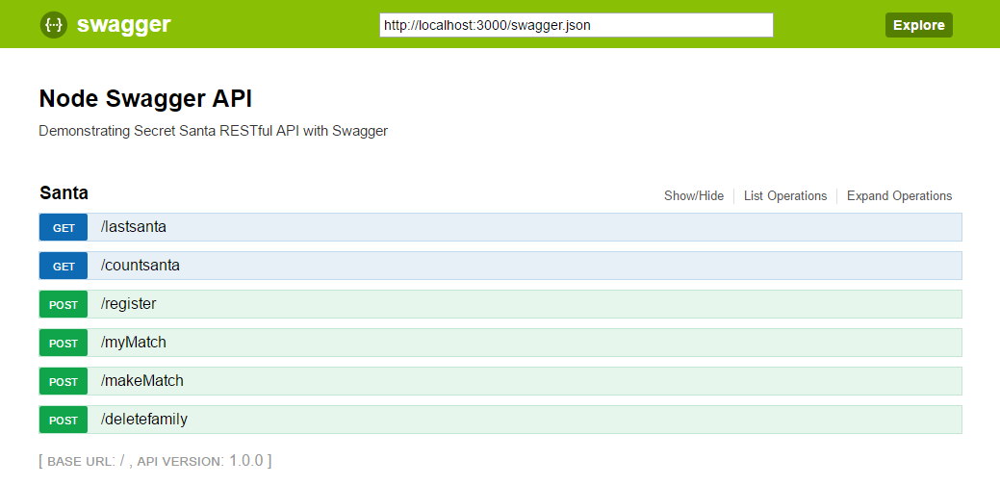

# Overview
Secret Santa :santa: is a Western Christmas tradition in which members of a group or community :family:are randomly assigned a person to whom they anonymously :alien: give a gift :gift:. This is a MEAN stack app for secret Santa.

## Demo

## APIs and technologies used so far
- HTML5, CSS, JS, [Bootstrap](http://getbootstrap.com/)
- [AngularJS 1.X](https://angularjs.org/)
- [NodeJS](https://nodejs.org/en/)
- [Express](http://expressjs.com/)
- [MongoDB](https://www.mongodb.org/), [MonngoLab](https://mlab.com/welcome/)
- [Yarn](https://yarnpkg.com/lang/en/) Facebook Package Manager
- [GulpJS](http://gulpjs.com/): As my building tool
- [SASS](http://sass-lang.com/): css of this project was short. but for warm up I put some SASS codes.
- [JSdoc](http://usejsdoc.org/): I am new to world! Codes are commented accordingly. For frontend JSdoc redult is on [gh-page of this repository](https://alireza-saberi.github.io/secret-santa/), and back-end RESTful API I learned about the [Swagger way](http://mherman.org/blog/2016/05/26/swagger-and-nodejs/#.WLYUNIErKUn), and I add it to project. So can find the `Demonstrating Secret Santa RESTful API with Swagger` at this address `http://localhost:3000/api-docs/`

## TODO
Time for this project was short. I have to add more stuff into that soon

- [ ] [Jasmine](https://jasmine.github.io/): As my test framework.
- [X] Avoid dupicated Santa.
- [X] Register spouse while a Santa registers.
- [ ] Mutiple family events: Waiting for round one review from interviewers.
- [ ] Refactoring UI codes for log-in based pools: Waiting for round one review from interviewers.
- [ ] None unique participants: Waiting for round one review from interviewers.
- [ ] [Emailing secret santa participants](https://github.com/ejthompson87/secret-santa): Waiting for round one review from interviewers.
- [ ] [Secret Santa over SMS with Twilio](https://github.com/lukekarrys/secret-santa-twilio): Waiting for round one review from interviewers.

## How to make it work on your machine
- Assumptions: You have 'Linux like terminal', `node` and `yarn` on your machine
- Clone the repository on your computer
- Run `yarn` in the `root directory`, and in the `app` directory of the project to get all of the dependencies.
- You need a `config` folder inside project `root`, and inside `config` should be two files `config.js` and `development.json. I can't put the here due to sensitive data.
- Type `npm start` or `node server.js` in the working directory shell.
- Go to your browser and type `localhost:3000` or `http://localhost:3000/`

## Documentation
Using jsDoc3 and gulp-pages, I have provided a small documentation on the gh-pages of this project live [here](https://alireza-saberi.github.io/secret-santa/)

## General Assumptions
- This is for one family e.g Smith family. 
- Each family member registers in the Christmas gift exchange to receive a gift.
- People can not receive a gift from their spouse. 
- Each Santa should be able to consult the name of the person that he/she have drawn so he/she can buy an appropriate gift. 
-	We assume that all the participants have a unique name. 
-	To get the name drawn for a participant, a member just has to enter his own name in the application. 
-	The Application is based on an honor system.  All participants can access the results of everyone in the draw. 
- The gift exchange admin can activate an automated draw to impress those who participate and save time.
- Admin email is `admin@smith.com`. And admin password is `123`
- Only if admin enters right information, then the pool can be stopped to build matches. 
- Only if admin enters right information, then the pool can be deleted. 

## My approach
- I found three dangrous scenarios.
  *  If parents are left at the end.
  *  One family of three people.
  *  Group of odd Santas if they exchange in couples, one of them will be left alone at the end.
- I found two approaches to solve this question. and I went with the second approach.
  * Person N will have change from 1-99 selection, N-1 from 1-98, and ... Challenge conditions will be applied.
  * We do shuffling for the Santa list. If the shuffled array of Santas meets the condition then we are good to continue
- If Santa enters his/her name twice server side should be able to handle duplication. With array it is easy. I was new to MongoDB but I fix it soon.
- If Santa enter his/her spouse name, sever should be able to handle and build spouse object too. With array it is easy. I was new to MongoDB but I fix it soon.

## Contribution			

You can fork the repository, improve or fix some part of it and then send the pull requests back if you want to see them here. I really appreciate that. ❤️	

## Issue tracker
Available [here](https://github.com/alireza-saberi/secret-santa/issues)

## License
[GPL License](LICENSE.txt)
